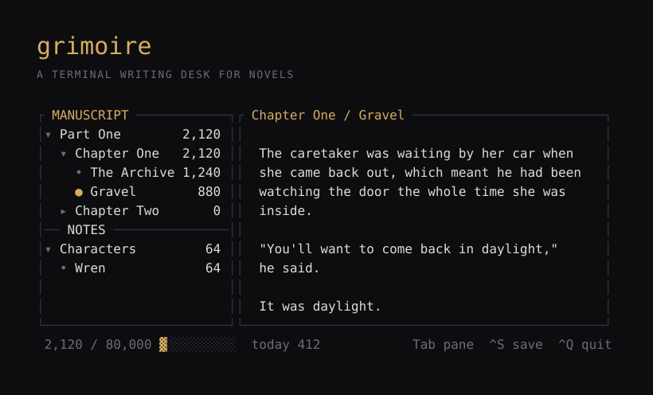

**[grimoire.joshking.ai](https://grimoire.joshking.ai)** · Rust + [Ratatui](https://ratatui.rs) · MIT · macOS and Linux

A writing desk for novels that lives in your terminal. It knows what a
manuscript is — parts, chapters, scenes, word targets — and it keeps every word
of it as plain files you could read with `cat`.

---

## Why it exists

Every open-source novel tool makes one of two mistakes. It traps your
manuscript in a database, or it's a text editor with no idea what a manuscript
is.

Grimoire does neither. **The directory tree is the outline.** There is no index
file, so there is nothing central to conflict when you sync across machines.
Reordering is renaming. Backing up is copying a folder.

If this project is abandoned tomorrow you still have your book. That is the
whole design constraint, and everything else follows from it.

## Install

Requires Rust 1.85 or newer.

```sh
git clone https://github.com/kelsierbot/GrimoireTUI
cd GrimoireTUI
cargo install --path .
grimoire
```

The crate is `grimoire-tui`; the binary it installs is `grimoire`. Make sure
`~/.cargo/bin` is on your `PATH`. A crates.io release is coming.

```sh
grimoire                          open your manuscript
grimoire ~/novels/the-archive     open a specific one
grimoire new ~/novels/next-one    start one
grimoire music-setup              install + connect YouTube Music
```

With no arguments it opens the current directory if it's a manuscript,
otherwise the last one you had open, otherwise it creates one in
`~/Documents/Grimoire`.

## On disk

Folders are containers, at any depth. Files are scenes. Order comes from the
name — a leading `01-` sorts the file and is stripped for display.

```
the-archive/
├─ novel.toml                    title, author, word targets
├─ manuscript/
│  └─ 01-part-one/
│     ├─ 01-chapter-one/
│     │  ├─ 01-the-archive.md    a scene
│     │  └─ 02-gravel.md
│     └─ 02-chapter-two/
├─ notes/
│  └─ characters/wren.md
└─ .grimoire/                    session state, gitignored
```

Scene metadata lives in YAML frontmatter:

```yaml
---
title: Gravel
pov: Wren
status: draft
synopsis: Confronts the caretaker in the lot.
target: 1200
---
```

Frontmatter is **round-tripped verbatim**. Grimoire reads a few keys and never
rewrites the block, so Obsidian and anything else can own fields it has never
heard of.

## Keys

| Key | |
|---|---|
| `Tab` / `Shift-Tab` | cycle panes — tree, editor, clearing, music |
| `↑ ↓` · `j k` | move in the tree |
| `Enter` · `Space` | fold or unfold a container · open a scene |
| `→` `l` / `←` `h` | expand / collapse, or jump to parent |
| `n` | new scene — at the end of the selected chapter (a selected part's last chapter) |
| `c` | new chapter — named for you ("Chapter Two"), at the end of the part you're in |
| `p` | new part — named for you ("Part Two"), at the end of the manuscript |
| `N` | new folder beside the selected one — for notes; in the manuscript it's a chapter or part |
| `Ctrl-S` | save all changed scenes |
| `Ctrl-C` | copy the selection |
| `Ctrl-Q` | quit — twice if unsaved |
| `Esc` | leave the editor |
| `F2` `F3` | start or pause the timer · reset |
| `F9` · `t` | themes |
| `←` `→` | in the clearing pane: switch view |
| `F4` `F5` `F6` | previous · play-pause · next |
| `F7` | the music player — queue, your playlists, search, and every control (also `F1`, or `Enter` on the music pane) |

Vertical movement in the editor is **visual, not logical** — Down moves one
screen row inside a wrapped paragraph rather than jumping the whole paragraph,
which is the only behaviour that feels right for prose.

Grimoire accepts `Ctrl` or `Cmd`, and the status bar labels whichever your
terminal can actually deliver. Cmd only reaches a terminal application through
the Kitty keyboard protocol — Ghostty, Kitty, WezTerm and foot support it,
Apple Terminal cannot send it at all. Ctrl always works.

## Themes

`F9` anywhere, or `t` from the tree. Nine presets — Grimoire, Gruvbox Dark,
Nord, Dracula, Solarized Dark, Catppuccin Mocha, Tokyo Night, Everforest and
**Lost Forest** — and `j`/`k` **previews each one live** as you move, so you
pick by looking rather than by name. `Enter` keeps it, `Esc` puts back what
you had.

Lost Forest is the one written for this app rather than borrowed. It is
green-led on purpose: `accent` drives focused borders, pane titles, the
open-scene marker and the progress bar, so a cyan accent would make the whole
interface read cyan. Cyan is kept for the two places it stays rare — the
break-time moon and the flowers — with a warm rust for warnings, since an
all-green palette otherwise hides its own alerts.

The last entry is **Custom…**, which opens a swatch editor: twelve named roles
(accent, text, dim, border, selection, warning, then the six the forest uses),
each showing its colour block and hex. Type six hex digits and it applies the
moment the sixth lands. It starts from whichever theme you were previewing, so
you can pick the closest preset and adjust from there.

Saved to `~/.config/grimoire/theme.toml`. Presets store only their name, so
they follow any future refinements; Custom stores every swatch.

## Mouse

It's a TUI, but the mouse works. Click a chapter to fold it, a scene to open
it, anywhere in the prose to put the caret there. Click the clearing to start
the timer, or the music pane to play and pause. The wheel scrolls whichever
pane is under the pointer without stealing focus.

**Drag to select.** Click and drag in the prose to select across lines;
`Ctrl-C` copies it (via `pbcopy`, `wl-copy`, `xclip` or `xsel`, whichever the
machine has). Any keystroke collapses the selection — it deliberately does not
delete it, because there is no undo yet and a stray key must never eat text.

Mouse capture does suppress the terminal's *own* drag-to-select. Grimoire's is
the replacement inside the prose pane; hold `Shift` while dragging if you want
the terminal's version anywhere else.

## The clearing

Below the manuscript tree is a forest, and the forest is the timer.

```
┌ focus · 18:04 ─────────────┐
│  ·                         │
│         ☀        ·         │
│    ▲      ▲       ▲        │
│   ▲▲▲    ▲▲▲     ▲▲▲    ▲  │
│  ▲▲▲▲▲  ▲▲▲▲▲   ▲▲▲▲▲  ▲▲▲ │
│    ┃      ┃       ┃     ┃  │
│   (\_/)            (\_/)   │
│   (•ᴥ•)    ❀  ✿    (•ᴥ•)   │
│▔▔▔▔▔▔▔▔▔▔▔▔▔▔▔▔▔▔▔▔▔▔▔▔▔▔▔▔│
└────────────────────────────┘
```

`←`/`→` cycles the pane through three views: **the clearing**; a **spectrum**
analyser that listens to whatever your Mac is playing (macOS 14.6+, once your
terminal is allowed under *Privacy & Security › Screen & System Audio
Recording › System Audio Recording Only*); and **growth** — a garden where
every 50 words you write today adds a stem, a leaf or a flower.

The sun's **position is the clock**. It crosses the sky over a twenty-five
minute session, so you read the time remaining off the light instead of
watching a number count down. Break time is night: the moon rises, the flowers
close, and fireflies come out between the rabbits.

## Music

Four sources, chosen from the menu (`F1` → Music source) and remembered.

| Source | How it works | Setup |
|---|---|---|
| **YouTube Music** | drives [th-ch/youtube-music](https://github.com/th-ch/youtube-music)'s API Server | `grimoire music-setup youtube-music` |
| **Spotify** | drives the desktop app — AppleScript on macOS, MPRIS on Linux | nothing to do |
| **Jellyfin** | **Grimoire plays it** — your files, your server | `grimoire music-setup jellyfin` |
| **Plex** | **Grimoire plays it** — your files, your server | `grimoire music-setup plex` |

### The player

`F7` opens it from anywhere. The top shows what's playing with a real progress
bar; below it are three tabs, switched with `Tab`:

- **Queue** — everything queued, following the playing track. `↑↓` to browse,
  `Enter` to jump to any song.
- **Playlists** — your YouTube Music library. `Enter` replaces the queue with a
  playlist and starts it; `a` queues the whole thing after the current song.
  `/` searches every public playlist on YouTube Music; `Esc` brings yours back.
- **Search** — `/`, type, `Enter`. `Enter` on a result plays it now; `a` plays
  it next. Songs and videos only.

Everywhere in the player: `space` pause · `←` `→` seek 10 s · `[` `]` previous /
next · `s` shuffle · `r` repeat · `+` `-` volume · `l` like · `Esc` close.

How playlists work, since the API Server has no "play playlist" call: Grimoire
reads the songs from YouTube Music's public web listing — so the playlist has
to be public or unlisted, and a private one tells you so — then queues them in
the app one at a time, first song first so the music starts straight away.
Playlists past 300 songs are cut there. Queue browsing also works for Jellyfin
and Plex; Spotify gets the controls but doesn't share its queue.

The split matters. There is no official YouTube Music API, and anything that
extracts stream URLs both violates the terms and side-steps the subscription
you already pay for — so for YouTube Music and Spotify, Grimoire never touches
audio. It presses buttons on a player you already run.

Jellyfin and Plex are the opposite case: your own files on your own hardware,
no terms to violate and no subscription to bypass. So Grimoire plays those
itself and nothing else has to be running.

**Spotify needs no setup at all.** Its Web API would mean OAuth, a registered
application and a refresh-token dance for the privilege of pressing pause. Both
platforms already expose the running player locally, so there is nothing to
sign into and no token to store. On Linux it wants `playerctl`.

**Jellyfin** signs in with the same username and password you use for the web
UI — no hunting through the dashboard for an API key. **Plex** needs an
`X-Plex-Token`, and the setup flow tells you where to find it.

Audio playback is a default cargo feature. On Linux it needs ALSA headers
(`libasound2-dev`); build with `--no-default-features` to drop it and keep the
remote-control sources.

## Status

**v0.1.** It opens a manuscript, shows you the shape of it, tracks your words,
and lets you write.

Not yet: command palette, corkboard view (`pov` and `status` are already parsed
and waiting for it), git sync, scene reordering, renaming and deleting from
inside the app, search, spellcheck, and undo.

## Development

```sh
cargo build --release
cargo test            # scene geometry and timer behaviour
cargo install --path .
```

```
src/main.rs      entry, event loop, key and mouse routing
src/app.rs       state, focus, per-pane input
src/project.rs   manuscript tree, frontmatter, scaffolding
src/editor.rs    word-wrapping buffer with visual cursor movement
src/scene.rs     the forest and the pomodoro
src/theme.rs     presets, custom palette, load/save
src/ui.rs        rendering
src/music.rs     youtube-music API Server client
site/            the landing page
```

Issues and pull requests welcome.

## License

MIT © Josh King
