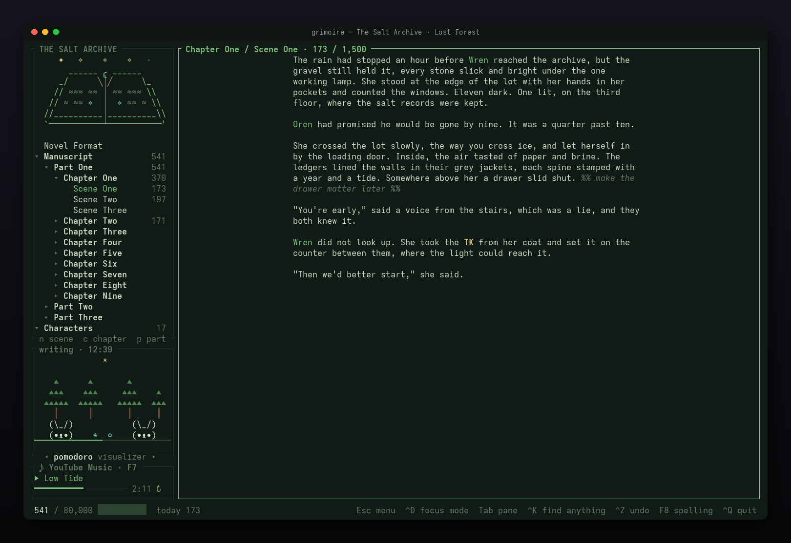
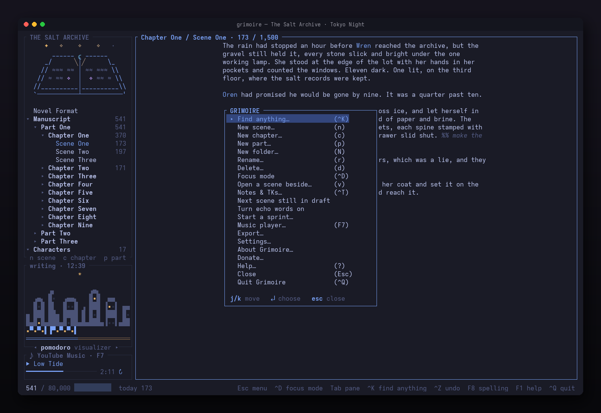
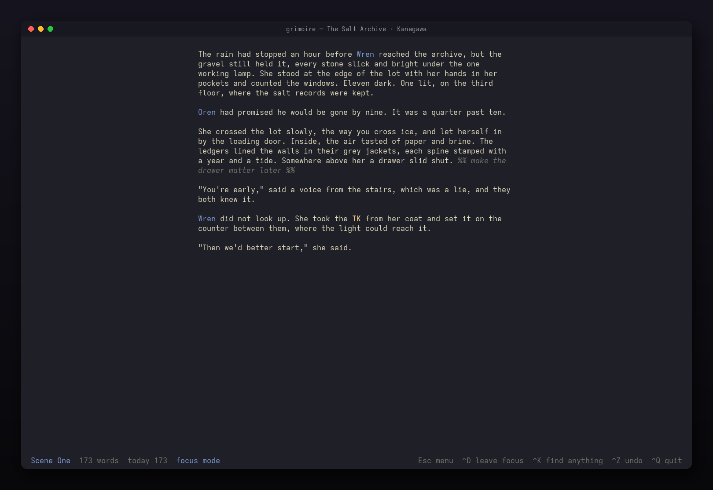
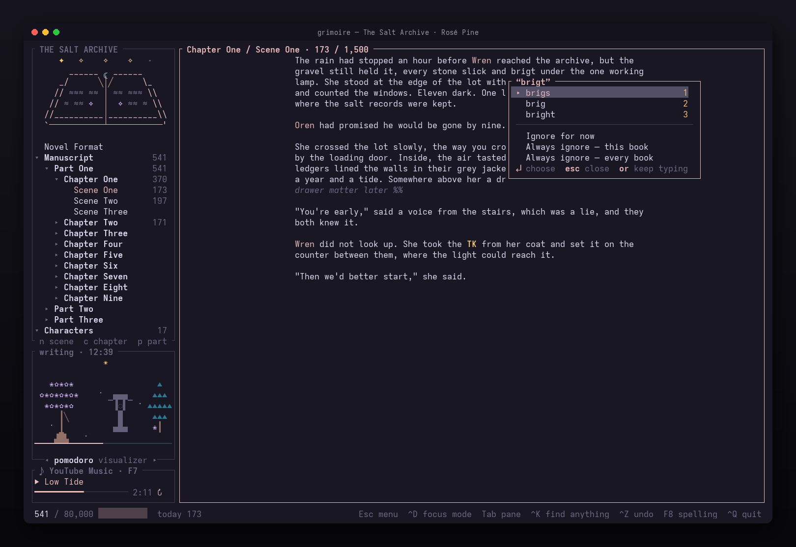
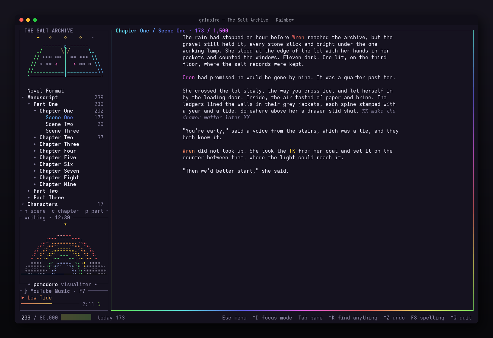
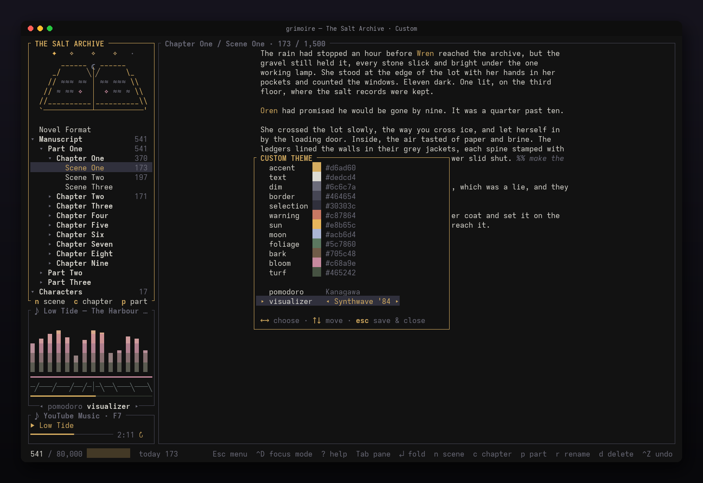
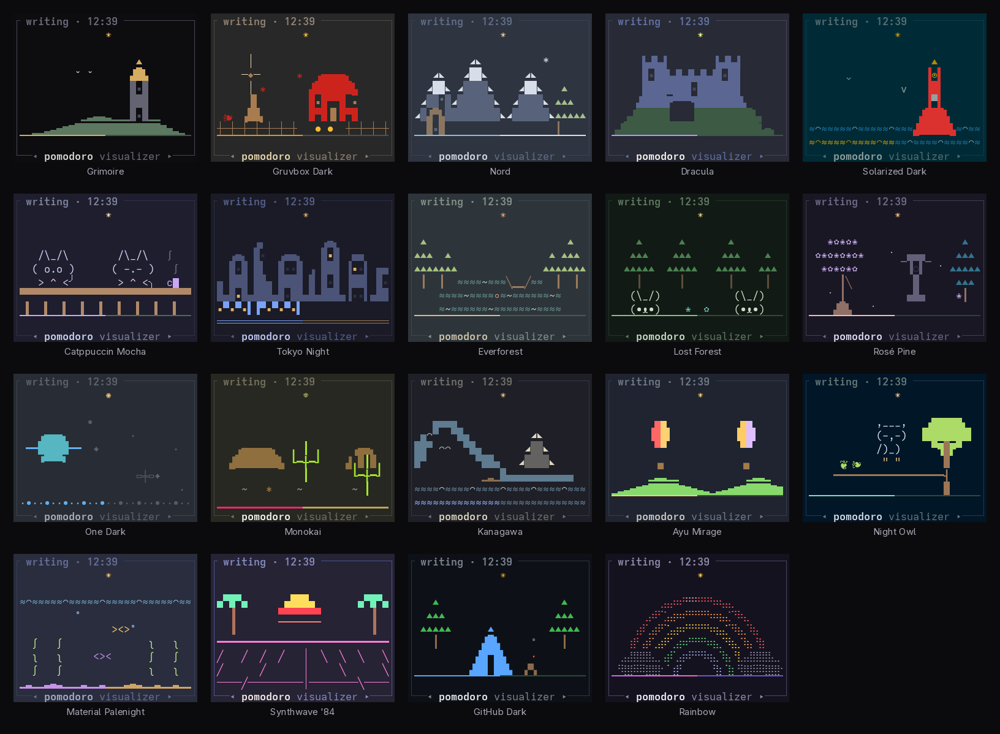
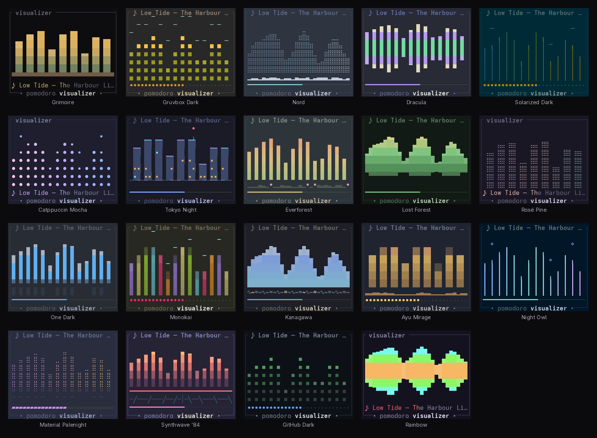

**[grimoire.joshking.ai](https://grimoire.joshking.ai)** · Rust + [Ratatui](https://ratatui.rs) · MIT · macOS, Linux and Windows

A writing desk for novels that lives in your terminal. It knows what a
manuscript is — parts, chapters, scenes, word targets — and it keeps every word
of it as plain files you could read with `cat`.

<p align="center"></p>

---

## Why it exists

Every open-source novel tool makes one of two mistakes. It traps your
manuscript in a database, or it's a text editor with no idea what a manuscript
is.

Grimoire does neither. **The directory tree is the outline.** There is no index
file, so there is nothing central to conflict when you sync across machines.
Reordering is renaming. Backing up is copying a folder.

If this project is abandoned tomorrow you still have your book. That is the
whole design constraint, and everything else follows from it.

## Install

**Windows** — open PowerShell or Command Prompt and paste:

```powershell
powershell -ExecutionPolicy Bypass -c "irm https://github.com/kelsierbot/GrimoireTUI/releases/latest/download/grimoire-tui-installer.ps1 | iex"
```

**macOS and Linux** — in a terminal:

```sh
curl --proto '=https' --tlsv1.2 -LsSf https://github.com/kelsierbot/GrimoireTUI/releases/latest/download/grimoire-tui-installer.sh | sh
```

Then open a **new** terminal (on Windows, Windows Terminal is best) and run
`grimoire`. Nothing else to install — no Rust, no build tools. The installer
puts `grimoire` in `~/.cargo/bin` and adds that to your `PATH`. Builds are for
Windows x64, macOS (Apple Silicon and Intel) and Linux (x86_64 and ARM64);
every download is on the [releases page](https://github.com/kelsierbot/GrimoireTUI/releases).

**With Homebrew** (macOS or Linux):

```sh
brew tap kelsierbot/tap
brew trust kelsierbot/tap
brew install grimoire
```

`brew upgrade` then brings each new release.

Settings live in `~/.config/grimoire` (`%USERPROFILE%\.config\grimoire` on
Windows) and a first manuscript goes in `Documents/Grimoire`.

**Linux needs two things every desktop distro already has:** glibc 2.35 or
newer (Ubuntu 22.04, Debian 12, Fedora 36 and later), and ALSA's audio library.
Minimal installs, servers, containers and WSL can be missing the library, and
then `grimoire` stops with `libasound.so.2: cannot open shared object file`.
Install it and run `grimoire` again:

```sh
sudo apt install libasound2t64   # Ubuntu 24.04+, Debian 13+ (older: libasound2)
sudo dnf install alsa-lib        # Fedora
sudo pacman -S alsa-lib          # Arch
```

### From source

Requires Rust 1.85 or newer.

```sh
git clone https://github.com/kelsierbot/GrimoireTUI
cd GrimoireTUI
cargo install --path .
```

The crate is `grimoire-tui`; the binary it installs is `grimoire`. On Windows,
install Rust with [rustup](https://rustup.rs) and let it add the Visual Studio
C++ build tools.

```sh
grimoire                          open your manuscript
grimoire ~/novels/the-archive     open a specific one
grimoire new ~/novels/next-one    start one
grimoire music-setup              install + connect YouTube Music
```

With no arguments it opens the current directory if it's a manuscript,
otherwise the last one you had open, otherwise it creates one in
`~/Documents/Grimoire`.

## On disk

Folders are containers, at any depth. Files are scenes. Order comes from the
name — a leading `01-` sorts the file and is stripped for display.

```
the-archive/
├─ novel.toml                    title, author, word targets, part_label
├─ Novel-Format.md               how the book is laid out
├─ manuscript/
│  ├─ 01-Part-One/
│  │  ├─ 01-Chapter-One/
│  │  │  ├─ 01-Scene-One.md      a scene
│  │  │  ├─ 02-Scene-Two.md
│  │  │  └─ 03-Scene-Three.md
│  │  └─ 02-Chapter-Two/ …
│  ├─ 02-Part-Two/ …
│  └─ 03-Part-Three/ …
├─ characters/                   the notebook: names here teach the
├─ places/                         spellchecker and the codex
├─ front-matter/
│  ├─ 01-Manuscript-Format/      title page for a Word submission
│  ├─ 02-Paperback/              title, copyright, dedication
│  └─ 03-Ebook/                  title, copyright, dedication
├─ notes/
├─ research/
│  └─ 01-Sample-Output/
├─ template-sheets/              Character Sketch, Setting Sketch
└─ .grimoire/                    session state, gitignored
   └─ trash/                     what you delete, still shown in the tree
```

The tree shows each of those as a section — Novel Format, Manuscript,
Characters, Places, Front Matter, Notes, Research, Template Sheets, Trash —
and every section and folder folds. A symbol beside each row is off to begin
with; turn tree icons on in `Esc` → Settings, or from the palette. The pane is headed
with the book's title and, when the window is tall enough to spare the rows,
an open spellbook with light rising from its spine.

**A new book arrives with its shape already standing:** three parts of nine
chapters, three scenes in each — twenty-seven chapters, eighty-one scenes, all
of them empty. The structure is a suggestion you rearrange; the writing is
never presumed. `part_label` in `novel.toml` is what this book calls its
largest division — `Part` to begin with, `Act` or `Book` if you prefer — and
the app says your word back everywhere it names one.

**Front matter goes by edition.** Pages in `Manuscript Format` go into the Word
export, pages in `Ebook` into the EPUB, and pages loose in `front-matter/` into
both. The starter pages are `compile: false` until you set them to `true`.

**Books from earlier versions are brought into this shape once, when they
open:** Characters, Places and Research move out of `notes/` into sections of
their own, missing sections are added, and `[[links]]` follow every move. Nothing
is deleted. A big book opens folded down to the first scene, so launching
shows you the shape rather than a hundred rows.

Scene metadata lives in YAML frontmatter:

```yaml
---
title: Gravel
pov: Wren
status: draft
synopsis: Confronts the caretaker in the lot.
target: 1200
---
```

Frontmatter is **round-tripped verbatim**. Grimoire reads a few keys and never
rewrites the block, so Obsidian and anything else can own fields it has never
heard of.

## Keys

Everything is one `Esc` away:

<p align="center"></p>

| Key | |
|---|---|
| `Esc` | **the menu**, from anywhere — new, rename, delete, export, the writing tools, settings, and *Quit Grimoire* at the bottom (`F1` works too). `Esc` again closes it; with a note or a scene open beside, the first `Esc` closes that |
| `Ctrl-K` | **find anything** — every action, scene, note and theme by name, with its key |
| `Tab` / `Shift-Tab` | cycle panes — tree, editor, the open note, Pomodoro, music |
| `↑ ↓` · `j k` | move in the tree |
| `Enter` · `Space` | fold or unfold a section or folder · open a scene |
| `→` `l` / `←` `h` | expand / collapse, or jump to parent |
| `n` | new scene — at the end of the selected chapter (a selected part's last chapter); in another section, a note, document or sheet there |
| `c` | new chapter — named for you ("Chapter Two"), at the end of the part you're in |
| `p` | new part — named for you ("Part Two", or "Act Two" if `part_label` says so), at the end of the manuscript |
| `N` | new folder beside the selected one — outside the manuscript; in it, a chapter or part |
| `r` | rename what's selected — the file is renamed to match and keeps its place |
| `d` | delete what's selected — asks first, then moves it to `.grimoire/trash` |
| `Ctrl-Z` `Ctrl-Y` *(in the tree)* | undo · redo a delete, rename, move or new item — a delete comes back from the trash to where it was |
| `Alt-↑` `Alt-↓` · `K` `J` | move what's selected up or down — a scene or folder crosses chapters and parts at the ends, a section changes places with its neighbour; dragging a row in the tree does the same |
| `H` | the scene's history — every kept version, what changed, restore any |
| `b` | the corkboard |
| `/` | find in the whole book |
| `Ctrl-F` | find in the scene (`Ctrl-F` again: the whole book) · `Tab` to replace · `Ctrl-R` replace all |
| `Ctrl-W` · `Ctrl-E` *(in find)* | whole words ↔ inside words · exact case ↔ any case (`Alt-W` / `Alt-C` too) |
| `Ctrl-Z` `Ctrl-Y` | undo · redo (`Ctrl-Shift-Z` too, where the terminal can send it) |
| `Ctrl-X` `Ctrl-C` | cut · copy the selection |
| `Ctrl-O` | open the note for the name under the cursor beside the scene — again to put it away |
| `v` *(in the tree)* | show the selected scene beside, read-only — `Esc` closes it, `Enter` writes in it |
| `Ctrl-D` | focus mode — just the prose; again to leave |
| `Ctrl-T` | notes & TKs — every `%% note %%` and TK in the book; type to filter, `Enter` to go there |
| `F8` | spelling suggestions for this word, or the next misspelling |
| `Ctrl-S` | save now — autosave already does, two seconds after you stop typing |
| `Ctrl-Q` · `q` in the tree | quit, saving everything first |
| `F2` `F3` | start or pause the timer · reset |
| `F9` · `t` | themes |
| `←` `→` | in the Pomodoro pane: switch between the Pomodoro and the Visualizer |
| `F4` `F5` `F6` | previous · play-pause · next (with music on) |
| *(music pane)* | the player's keys: `[` `]` track · `space` pause · `←` `→` seek · `r` repeat · `s` shuffle · `+` `-` volume · `l` like · `Enter` the player |
| `F7` | the music player — queue, your playlists, search, and every control (also in the menu, or `Enter` on the music pane) |

## Writing

- **Focus mode** (`Ctrl-D`) hides everything but the prose: centred, no
  frame, a quiet status line. `Esc` still opens the menu.
- **A readable line.** Prose wraps at 72 columns, centred in the pane —
  *Line width* in the menu's Settings cycles 60 / 72 / 80 / 100 / full. In
  focus mode the line you're writing stays mid-screen (*Typewriter scrolling*);
  elsewhere you're never drafting on the bottom row.
- **Notes that never reach the book.** `%% like this %%` (Obsidian's comment
  syntax, across lines if you like) and `TK` are dimmed as you write, left out
  of every word count, compile and export, and kept on disk exactly as typed.
  `Ctrl-T` lists them all.
- **Sprints and targets.** *Start a sprint…* sets a word goal and minutes and
  starts the timer; the status bar counts `sprint 212/500 · 14:32`. A scene's
  `target:` shows as progress in the editor's title.
- **Revision passes.** *Next scene still in draft* walks the book by status;
  *Echo words* lights a word used again within forty words.
- **A scene beside** (`v` in the tree): another scene, read-only, next to the
  one you're writing, for continuity.

<p align="center"></p>

## Nothing is lost

- **Changes made elsewhere are never overwritten.** Grimoire looks at the book
  on disk every couple of seconds. An edit from Obsidian, a sync app or the
  phone is taken in; if you had unsaved words in that scene too, they're kept
  beside it as *Scene (from this-computer, date)* — a parked copy — and neither
  version is lost. Scenes added, moved or deleted elsewhere show up by
  themselves. A file that isn't UTF-8 opens read-only and is never rewritten.

- **Autosave.** A scene is written two seconds after you stop typing, and
  never sits unsaved longer than twenty. Every write goes through a temporary
  file, so a crash mid-save can't tear a scene in half. Closing the terminal
  window, logging out or `kill` saves first; so does quitting.
- **Recovery.** If a save fails (a full disk, a file another program has
  locked) or Grimoire crashes, the words go to `.grimoire/recovery/` and the
  next launch offers them back beside the saved version — chosen with the
  arrows and `Enter`, never by a stray key; declining puts them in the trash.
- **Undo.** A word at a time, per scene, kept when you switch scenes. Typing
  over a selection replaces it; a paste is one step; a replace across the
  whole book is one step too.
- **Moves can't strand anything.** A move that can't finish (a locked folder,
  a sync app holding a file) puts everything back, and anything a crash left
  mid-move reappears when the book opens.
- **History.** Every scene keeps dated copies as you work — at most every five
  minutes, plus how it was before today's first change and before anything
  drastic — in `.grimoire/history/`, as plain Markdown. `H` lists them with a
  word diff against now and restores any version (itself undoable).

## Finding and shaping

- **Find and replace** in a scene or across the book, grouped by part and
  chapter, with a preview before anything is replaced across scenes (each
  scene's previous version goes to its history first). Whole words in their
  exact case unless you say otherwise (`Ctrl-W`, `Ctrl-E`).
- **Name drift** (palette: *Check names*): spellings one or two letters away
  from a name in your notebook — *Kaelan* where the Characters note says
  *Kaelen* — with where they are, fixed in one go.
- **Spellcheck** underlines misspellings from a bundled en_US dictionary and
  never flags your notebook's names. Click an underlined word, or right-click
  it, for suggestions right there — or to ignore it: until you close Grimoire,
  always in this book, or always in every book
  (`~/.config/grimoire/dictionary.txt`). Words you add go in `dictionary.txt` at
  the book's root. On unless turned off (palette).
- **Moving** a scene or folder renames only the files whose number changes,
  and rewrites `[[links]]` in your notes that pointed at them.
- **The corkboard** (`b`) shows a part as index cards chapter by chapter:
  POV (each character in its own colour), status, synopsis, words against
  target. `p` filters to one POV; `s`, `e` and `v` edit the card, changing only
  that line of the scene's frontmatter.

<p align="center"></p>

## The notebook and the prose

Names from your notebook — note titles, their `aliases:`, the distinctive
words of a longer title — show in the accent colour as you write. `Ctrl-O` on
one opens that note beside the scene, with **Appears in**: every scene that
mentions it. Nothing extra is stored; it's all read from the files.

## Readers, and other computers

- **Export** (`Esc` › *Export…*): a Word document in standard manuscript format, an
  EPUB for phones and e-readers, and Markdown — the whole book or chosen parts —
  into `exports/`. Also `grimoire export [--docx] [--epub] [--md] [--parts 1,3]`.
- **Resume.** `.grimoire/resume.md` remembers the scene and paragraph you were
  at, so opening the book on any computer the folder reaches lands you there.
- **Writing sessions** (palette): turn on history for the book and each
  session is kept as a snapshot labelled like a diary line — *Tuesday evening ·
  Act Two · 1,240 words* — with what changed that session. It's Git, kept on
  this machine outside the book folder (so a sync service can't damage it);
  connect a remote and sessions back themselves up in the background. Needs
  Git installed.

Vertical movement in the editor is **visual, not logical** — Down moves one
screen row inside a wrapped paragraph rather than jumping the whole paragraph,
which is the only behaviour that feels right for prose.

Grimoire accepts `Ctrl` or `Cmd`, and the status bar labels whichever your
terminal can actually deliver. Cmd only reaches a terminal application through
the Kitty keyboard protocol — Ghostty, Kitty, WezTerm and foot support it,
Apple Terminal cannot send it at all. Ctrl always works.

## Keeping a book in Dropbox, Google Drive, pCloud or Box

A book is a folder, so any sync service carries it — OneDrive and iCloud
Drive too. What Grimoire does about the ways syncing goes wrong:

- **Two devices change one scene.** Nothing is written over. Grimoire checks
  the file before every save; if it changed elsewhere, the other version stays
  the scene and this one is kept beside it as a *parked copy*. The copies a
  sync service makes itself are recognised too — they're parked, never
  counted or exported twice — and *Settle conflicts…* shows the two side by
  side to keep one, the other or both.
- **A file isn't here yet** (online-only, still downloading, offline). It
  shows as offline and is never saved over; Grimoire tries again later.
- **A file blinks** while a service replaces it. A scene that vanishes for a
  moment isn't treated as deleted.
- **Names.** Everything Grimoire names is safe on every service and system:
  no `? : * " < > |`, no names Windows reserves, nothing too long, and never
  two names that differ only in capitals or accents (`Wren.md` and `wren.md`
  are one file on a Mac, on Windows and in Box). Two such files already in a
  folder are both shown, marked *name clash*, for you to rename.
- **Writing-session history** stays on each machine, outside the book. An
  older book with `.git` inside a synced folder is told once, and *Move
  writing history out…* moves it.

Advice: keep the book folder available offline ("Always keep on this
device" / "Make available offline"); don't put one book in two sync services
at once; and let a service finish syncing before opening the book on another
device.

What each service calls its conflict copies (Grimoire recognises them all):

| Service | Conflict copy |
|---|---|
| Dropbox | `Scene (Ann's conflicted copy 2026-09-25).md` |
| Google Drive | `Scene (1).md` — only a copy when `Scene.md` is beside it |
| pCloud | `Scene (conflicted).md`, `Scene [conflicted].md` |
| Box | `Scene (1).md`, `Scene (ann@example.com).md` |
| OneDrive | `Scene-LAPTOP.md` |
| iCloud Drive | `Scene 2.md` |
| Grimoire itself | `Scene (from laptop, 2026-09-25 14-02).md` |

## Themes

`F9` anywhere, or `t` from the tree. Nineteen presets — Grimoire, Gruvbox
Dark, Nord, Dracula, Solarized Dark, Catppuccin Mocha, Tokyo Night,
Everforest, **Lost Forest**, Rosé Pine, One Dark, Monokai, Kanagawa, Ayu
Mirage, Night Owl, Material Palenight, Synthwave '84, GitHub Dark and
**Rainbow** — each row showing a strip of its colours, and `j`/`k` **previews
each one live** as you move, so you pick by looking rather than by name.
`Enter` keeps it, `Esc` puts back what you had. All of them are dark themes:
Grimoire draws on your terminal's own background.

<p align="center"></p>

**Rainbow** isn't a flat palette. Everything the others draw in their accent —
the focused border, titles, the progress bar, the word count — is painted as a
diagonal sweep of the spectrum that drifts round the wheel about once a
minute; the Visualizer's bars climb from red to violet; and its Pomodoro is a
rainbow over the hills.

Lost Forest is the one written for this app rather than borrowed. It is
green-led on purpose: `accent` drives focused borders, pane titles, the
open-scene marker and the progress bar, so a cyan accent would make the whole
interface read cyan. Cyan is kept for the two places it stays rare — the
break-time moon and the flowers — with a warm rust for warnings, since an
all-green palette otherwise hides its own alerts.

The last entry is **Custom…**, which opens a swatch editor: twelve named roles
(accent, text, dim, border, selection, warning, then the six the forest uses),
each showing its colour block and hex. Type six hex digits and it applies the
moment the sixth lands. It starts from whichever theme you were previewing, so
you can pick the closest preset and adjust from there.

Below the swatches, **Custom mixes and matches**: `pomodoro` and `visualizer`
each borrow any preset's — Kanagawa's great wave with Synthwave '84's neon
grid, say — cycled with `←` `→` and previewed in the pane under the tree as
you go. Entering Custom from a preset starts from that preset's world and look.

<p align="center"></p>

Saved to `~/.config/grimoire/theme.toml`. Presets store only their name, so
they follow any future refinements; Custom stores every swatch.

## Mouse

It's a TUI, but the mouse works. Click a chapter to fold it, a scene to open
it, anywhere in the prose to put the caret there. Click the Pomodoro to start
the timer, or the music pane to play and pause. The wheel scrolls whichever
pane is under the pointer without stealing focus.

**Drag to select.** Click and drag in the prose to select across lines;
`Ctrl-C` copies it (via `pbcopy`, `wl-copy`, `xclip` or `xsel`, whichever the
machine has). Any keystroke collapses the selection — it deliberately does not
delete it, because there is no undo yet and a stray key must never eat text.

Mouse capture does suppress the terminal's *own* drag-to-select. Grimoire's is
the replacement inside the prose pane; hold `Shift` while dragging if you want
the terminal's version anywhere else.

## The Pomodoro

Below the manuscript tree is a small world, and the world is the timer.

<p align="center"></p>

The sun's **position is the clock**. `F2` starts it; it crosses the sky over a
twenty-five minute writing session, so you read the time remaining off the
light instead of watching a number count down, and the ground beneath fills
in behind it. Paused, the sun waits, dimmed. Break time is night: the moon
rises and the world's night things come out.

**Every theme has its own world.** Lost Forest's glade and its rabbits (above,
and for any custom palette); a wizard's tower for Grimoire, its windows lit at
night; an autumn farm with a turning windmill for Gruvbox; snowy peaks and the
aurora for Nord; a castle and its bats for Dracula; a lighthouse sweeping the
sea for Solarized; two cats on a fence for Catppuccin; a skyline and its night
train for Tokyo Night; a lake in the woods for Everforest; a blossom tree and a
stone lantern for Rosé Pine; a ringed planet for One Dark; the desert for
Monokai; the great wave for Kanagawa; hot-air balloons for Ayu Mirage; an owl,
asleep until dark, for Night Owl; a reef for Palenight; a neon horizon for
Synthwave '84, where the striped sun itself is the clock; a campsite for GitHub
Dark; and a rainbow of fine ribbons standing in two clouds for Rainbow. All of them move slowly, if at
all — this sits beside someone writing.

`←`/`→` switches the pane to the **Visualizer**, which listens to whatever the
computer is playing — on a Mac (macOS 14.6+, once your terminal is allowed
under *Privacy & Security › Screen & System Audio Recording › System Audio
Recording Only*), and on Linux through PipeWire's `pw-record` or PulseAudio's
`parec` (set `GRIMOIRE_MONITOR=<sink>` to hear an output other than the
default). It too is drawn in each theme's own style — meter segments for
Gruvbox, pastel beads for Catppuccin, dotted frost over snowdrifts for Nord, a
neon skyline for Tokyo Night, a rolling wave for Kanagawa, a synthwave grid, a
mirrored prism for Rainbow — and it always names the song that's playing, in
its title or written along the bottom, cut to fit.

<p align="center"></p>

## Music

Music is **off until you turn it on** — from the menu (`Esc` → Settings → *Turn music on*)
or the palette. Setting a source up turns it on too. Four sources, chosen from
the menu (`Esc` → Settings → Music source) and remembered.

| Source | How it works | Setup |
|---|---|---|
| **YouTube Music** | drives [th-ch/youtube-music](https://github.com/th-ch/youtube-music)'s API Server | `grimoire music-setup youtube-music` |
| **Spotify** | drives the desktop app — AppleScript on macOS, MPRIS on Linux (not Windows yet) | nothing to do |
| **Jellyfin** | **Grimoire plays it** — your files, your server | `grimoire music-setup jellyfin` |
| **Plex** | **Grimoire plays it** — your files, your server | `grimoire music-setup plex` |

### The player

`F7` opens it from anywhere. The top shows what's playing with a real progress
bar; below it are three tabs, switched with `Tab`:

- **Queue** — everything queued, following the playing track. `↑↓` to browse,
  `Enter` to jump to any song.
- **Playlists** — your YouTube Music library. `Enter` replaces the queue with a
  playlist and starts it; `a` queues the whole thing after the current song.
  `/` searches every public playlist on YouTube Music; `Esc` brings yours back.
- **Search** — `/`, type, `Enter`. `Enter` on a result plays it now; `a` plays
  it next. Songs and videos only.

Everywhere in the player — and on the music pane when it has focus: `space`
pause · `←` `→` seek 10 s · `[` `]` previous / next · `s` shuffle · `r` repeat ·
`+` `-` volume · `l` like · `Esc` close. The player shows repeat, shuffle,
volume and like under the progress bar, the pane shows `↻` (repeat all), `↻1`,
`⇄` and `♥` beside the time, and each key says what it did — "repeat: one",
"volume 70" — or why the player refused it.

How playlists work, since the API Server has no "play playlist" call: Grimoire
reads the songs from YouTube Music's public web listing — so the playlist has
to be public or unlisted, and a private one tells you so — then queues them in
the app one at a time, first song first so the music starts straight away.
Playlists past 300 songs are cut there. Queue browsing also works for Jellyfin
and Plex; Spotify gets the controls but doesn't share its queue.

The split matters. There is no official YouTube Music API, and anything that
extracts stream URLs both violates the terms and side-steps the subscription
you already pay for — so for YouTube Music and Spotify, Grimoire never touches
audio. It presses buttons on a player you already run.

Jellyfin and Plex are the opposite case: your own files on your own hardware,
no terms to violate and no subscription to bypass. So Grimoire plays those
itself and nothing else has to be running.

**Spotify needs no setup at all.** Its Web API would mean OAuth, a registered
application and a refresh-token dance for the privilege of pressing pause. Both
platforms already expose the running player locally, so there is nothing to
sign into and no token to store. On Linux it wants `playerctl`. Windows has
no equivalent Grimoire can use yet, so Spotify is macOS and Linux only.

**YouTube Music setup** installs the app for you on all three. On macOS and
Linux it asks whether the machine is x86 or ARM (Enter takes what it detects);
on Windows the installer picks the right build itself, so it doesn't ask.

**Jellyfin** signs in with the same username and password you use for the web
UI — no hunting through the dashboard for an API key. **Plex** needs an
`X-Plex-Token`, and the setup flow tells you where to find it.

Audio playback is a default cargo feature. On Linux it needs ALSA headers
(`libasound2-dev`); build with `--no-default-features` to drop it and keep the
remote-control sources.

## Status

**v0.2 (unreleased).** Everything above: autosave, recovery, undo and history;
the palette; find and replace; spellcheck and name drift; moving scenes; the
corkboard; the codex; export; resume and writing sessions.

Limits: spellcheck is English only, and Spotify isn't supported on Windows.

## Development

```sh
cargo build --release
cargo test --workspace   # the book on disk, the desk frame by frame, every theme's world
cargo install --path .
```

```
crates/grimoire-core/  the book on disk: project, editor, history, export, search, sync
crates/grimoire-app/   services for the phone app over the same core
apps/mobile/           the Android app (Tauri)
src/main.rs            entry, event loop, key and mouse routing
src/app.rs             state, focus, per-pane input; src/app/overlays/ one file per dialog
src/ui.rs              rendering
src/scene.rs           the Pomodoro timer; src/scenery.rs every theme's world
src/visualizer.rs      audio capture and the analyser; src/viz_view.rs every theme's look
src/theme.rs           presets, custom palette, load/save
src/music/             one file per music source, plus setup
site/                  the landing page
```

The screenshots in this README are drawn by Grimoire itself, from a sample
book, then painted to PNG:

```sh
GRIMOIRE_SHOTS=/tmp/frames.json cargo test --locked shots -- --ignored
python3 tools/screenshots.py /tmp/frames.json assets/screenshots   # Pillow + fontTools
```

### Releasing

Bump `version` in `Cargo.toml`, add a matching section to `CHANGELOG.md`,
commit, then tag and push the tag:

```sh
git tag v0.2.0 && git push origin v0.2.0
```

The **Release** workflow ([dist](https://github.com/axodotdev/cargo-dist))
builds every platform and publishes the GitHub release with both installers;
**installer-check** then installs it with the one-liners on Windows, macOS and
Linux and runs it. Nothing is published unless every build succeeds.

Issues and pull requests welcome.

## License

MIT © Josh King
